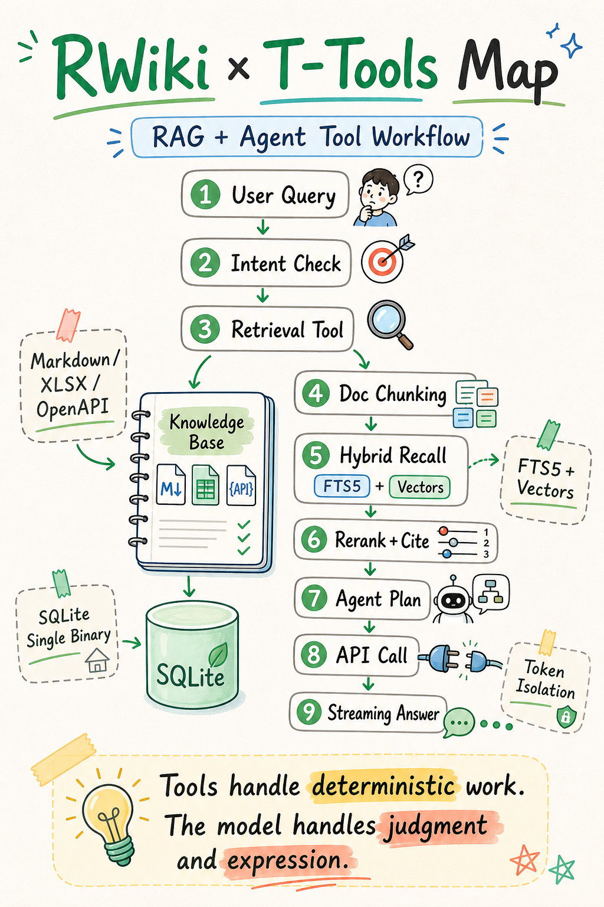

# RWiki

**Knowledge base Q&A powered by RAG. Single binary, zero external databases.**

Upload Markdown, XLSX, or OpenAPI specs — RWiki chunks and vectorizes them, then serves streaming answers with structured citations. Hybrid search (keyword + vector), query rewrite, and local embedding support built in. Runs on SQLite, deploys with one command, works with any OpenAI-compatible LLM.

[中文文档](README.zh-CN.md)



## Quick Start

```bash
docker run -d -p 8080:8080 \
  -v rwiki-data:/app/data \
  -e OPENROUTER_API_KEY=your-llm-key \
  -e OPENAI_API_KEY=your-embedding-key \
  ghcr.io/timzaak/rwiki
```

Open `http://localhost:8080`, upload a document, publish, start chatting.

Or try the demo:

```bash
cd scripts && pip install -r requirements.txt && python demo-start.py
```

## Why RWiki

Most RAG setups need PostgreSQL + pgvector, Redis, a vector database, and a Docker Compose file with 5 services. For teams that just want "upload docs, ask questions," that's overkill.

RWiki does one thing — knowledge base Q&A — and keeps the infrastructure to a single binary with SQLite.

| | RWiki | Typical RAG Stack |
|---|---|---|
| Database | SQLite (built-in) | PostgreSQL + pgvector |
| Dependencies | None | Redis, vector DB, message queue |
| Deployment | Single binary | Docker Compose, 3–5 services |
| Setup | `docker pull` and run | Hours of configuration |

## Features

- **Streaming chat Q&A** — Ask questions, get answers with structured citations (title, section, link, tags) from your documents
- **Hybrid search** — FTS5 full-text + vector similarity with RRF fusion for better recall
- **Query rewrite & expansion** — Automatic query rewriting with multi-query expansion to handle ambiguous questions
- **Embeddable chat widget** — Single JS file, Shadow DOM, add to any site with two lines of HTML
- **Multi-format ingestion** — Markdown files, XLSX spreadsheets, OpenAPI specifications
- **API documentation assistant** — Upload OpenAPI specs, ask questions about your APIs
- **Provider-agnostic** — OpenAI, OpenRouter, BigModel, any OpenAI-compatible endpoint
- **Local embedding** — Use built-in multilingual embeddings without an external API key
- **RAG evaluation pipeline** — Built-in eval endpoint exposes retrieval metrics (HitRate, MRR, Recall) and answer quality scoring; run regression tests against golden datasets with a single script
- **Observability** — OpenTelemetry / Jaeger tracing support for production monitoring
- **Configurable** — Custom system prompts, content language settings, and conversation memory tuning

## Deploy

### Docker (recommended)

```bash
docker pull ghcr.io/timzaak/rwiki
docker run -d -p 8080:8080 \
  -v rwiki-data:/app/data \
  -e OPENROUTER_API_KEY=your-llm-key \
  -e OPENAI_API_KEY=your-embedding-key \
  ghcr.io/timzaak/rwiki
```

### From Source

Prerequisites: Rust (latest stable), Node.js 20+, an OpenAI-compatible embedding API key.

```bash
git clone https://github.com/timzaak/rwiki
cd rwiki/backend
cp config/config.example.toml config/config.toml
# Edit config.toml — set your API keys
cargo run
```

## Configuration

Copy `backend/config/config.example.toml` to `config.toml` and edit. All options with comments are documented there.

## AI-Built

This project is built entirely with [Claude Code](https://docs.anthropic.com/en/docs/claude-code) + [web-dev-skills](https://github.com/timzaak/web-dev-skills).

```bash
git clone https://github.com/timzaak/web-dev-skills
claude --plugin-dir /path/to/web-dev-skills
```

## License

[Apache License 2.0](LICENSE)
