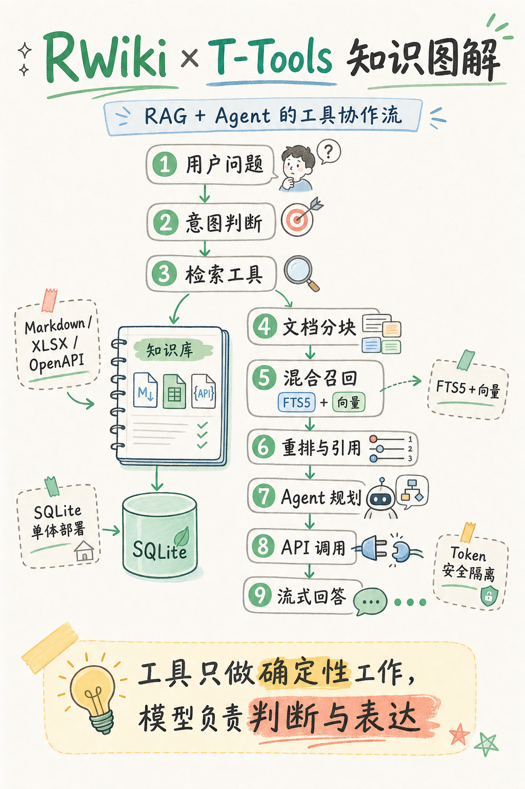

# RWiki

**基于 RAG 的知识库问答。单个二进制文件，零外部数据库。**

上传 Markdown、XLSX 或 OpenAPI 规格文件 — RWiki 自动分块、向量化，提供带结构化引用的流式问答。内置混合搜索（关键词 + 向量）、查询改写和本地 Embedding 支持。基于 SQLite 运行，一条命令部署，支持任何 OpenAI 兼容的 LLM。

[English](README.md)



## 快速开始

将 LLM Key 填入 `config.toml` 的 `[llm].api_key`（支持任意 OpenAI 兼容 provider，参考 `backend/config/config.example.toml`），然后：

```bash
docker run -d -p 8080:8080 \
  -v rwiki-data:/app/data \
  -v ./config.toml:/app/config.toml:ro \
  -e OPENAI_API_KEY=your-embedding-key \
  ghcr.io/timzaak/rwiki
```

`OPENAI_API_KEY` 设置 Embedding Key。打开 `http://localhost:8080`，上传文档，发布，开始对话。

或运行演示：

```bash
cd scripts && pip install -r requirements.txt && python demo-start.py
```

## 为什么选择 RWiki

大多数 RAG 方案需要 PostgreSQL + pgvector、Redis、向量数据库，外加一个包含 5 个服务的 Docker Compose 文件。对于只想"上传文档、提问回答"的团队来说，这太重了。

RWiki 只做一件事 — 知识库问答 — 并把基础设施压缩到一个二进制文件和 SQLite。

| | RWiki | 典型 RAG 方案 |
|---|---|---|
| 数据库 | SQLite（内置） | PostgreSQL + pgvector |
| 依赖 | 无 | Redis、向量数据库、消息队列 |
| 部署 | 单个二进制 | Docker Compose，3–5 个服务 |
| 配置 | `docker pull` 并运行 | 数小时配置 |

## 特性

- **流式对话问答** — 提问，获取带结构化引用（标题、章节、链接、标签）的回答
- **混合搜索** — FTS5 全文 + 向量相似度，使用 RRF 融合提升召回率
- **查询改写与扩展** — 自动查询改写与多查询扩展，处理模糊提问
- **可嵌入聊天组件** — 单个 JS 文件，Shadow DOM，两行 HTML 嵌入任意网站
- **多格式导入** — Markdown 文件、XLSX 表格、OpenAPI 规格
- **API 文档助手** — 上传 OpenAPI 规格，向 API 提问
- **LLM 无关** — 支持 OpenAI、OpenRouter、BigModel 等任何 OpenAI 兼容接口
- **本地 Embedding** — 内置多语言 Embedding，无需外部 API Key
- **可观测性** — 支持 OpenTelemetry / Jaeger 链路追踪
- **可配置** — 自定义系统提示词、内容语言设置、对话记忆参数

## 部署

### Docker（推荐）

```bash
docker pull ghcr.io/timzaak/rwiki
docker run -d -p 8080:8080 \
  -v rwiki-data:/app/data \
  -v ./config.toml:/app/config.toml:ro \
  -e OPENAI_API_KEY=your-embedding-key \
  ghcr.io/timzaak/rwiki
```

### 从源码构建

前置条件：Rust（最新稳定版）、Node.js 20+、OpenAI 兼容的 Embedding API Key。

```bash
git clone https://github.com/timzaak/rwiki
cd rwiki/backend
cp config/config.example.toml config/config.toml
# 编辑 config.toml — 设置 API Key
cargo run
```

## 配置

将 `backend/config/config.example.toml` 复制为 `config.toml` 并编辑。所有选项均有注释说明。

## AI 构建

本项目完全使用 [Claude Code](https://docs.anthropic.com/en/docs/claude-code) + [web-dev-skills](https://github.com/timzaak/web-dev-skills) 开发。

```bash
git clone https://github.com/timzaak/web-dev-skills
claude --plugin-dir /path/to/web-dev-skills
```

## 许可证

[Apache License 2.0](LICENSE)
