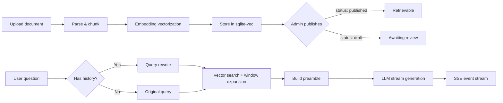

RWiki is a RAG + Agent knowledge base Q&A platform. The Rust backend (Axum) handles document parsing, vectorization, retrieval, and streaming chat. The React SPA provides the chat UI, and a widget lets you embed it in external sites.

## Tech Stack

- **Backend**: Rust + Axum + rusqlite + sqlite-vec + rig-core
- **Frontend**: React + TypeScript + TanStack Router/Query + Tailwind CSS

sqlite-vec was chosen over Pinecone / Milvus because rwiki targets lightweight private deployments — a single binary and a `.db` file is all you need. The tradeoff is no horizontal scaling, but for a single-team knowledge base this is fine.

rig-core handles LLM calls because it provides a thin wrapper over OpenAI-compatible APIs, supporting OpenAI, OpenRouter, BigModel and others. Switching providers is just a `base_url` change.

## Core Flow: RAG Pipeline

From document upload to the user receiving an answer, data flows through these stages:

### Upload & Parsing

Upload files via `POST /api/documents/upload` (requires Bearer Token). Supported formats:

- **.xlsx**: Parsed row by row, each row formatted as `header1: value1, header2: value2, ...`.
- **.md / .mdx**: Chunked by Markdown heading levels, with YAML frontmatter metadata extraction.

Overlong chunks are further split at Markdown semantic boundaries.

### Vectorization & Storage

Each chunk's text goes through the Embedding API to produce vectors (batched, 64 per batch), stored in the sqlite-vec virtual table. Identical content is deduplicated, skipping redundant API calls.

### Document States

State flow: `processing` → `draft` → `published` (or `failed`).

- `processing`: Parsing and vectorizing after upload
- `draft`: Processing complete, waiting for admin review. Content is not searchable in this state.
- `published`: Admin has confirmed publication. Chunks participate in vector retrieval.

The draft state exists because data quality is unpredictable — a manual review step is safer than publishing first and deleting later.

### Retrieval & Chat

Users chat via `POST /api/chat` (no auth required):

1. **Session management**: Request carries an optional `sessionId`. If absent, a new one is generated.
2. **Query rewrite**: If there's conversation history, the LLM rewrites follow-up questions into standalone queries.
3. **Vector search + window expansion**: Vector search returns top-5 results, then adjacent chunks are fetched by `page_id` and `sub_index` to get complete context.
4. **Streaming generation**: Results are pushed to the frontend via SSE events: `session`, `chunk`, `done`, `error`.
