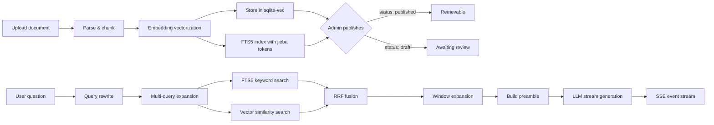

RWiki is a RAG + Agent knowledge base Q&A platform. The Rust backend (Axum) handles document parsing, vectorization, retrieval, and streaming chat. The React SPA provides the chat UI, and a widget lets you embed it in external sites.

## Tech Stack

- **Backend**: Rust + Axum + rusqlite + sqlite-vec + rig-core
- **Frontend**: React + TypeScript + TanStack Router/Query + Tailwind CSS

sqlite-vec was chosen over Pinecone / Milvus because rwiki targets lightweight private deployments — a single binary and a `.db` file is all you need. The tradeoff is no horizontal scaling, but for a single-team knowledge base this is fine.

rig-core handles LLM calls because it provides a thin wrapper over OpenAI-compatible APIs, supporting OpenAI, OpenRouter, BigModel and others. Switching providers is just a `base_url` change.

## Core Flow: RAG Pipeline

From document upload to the user receiving an answer, data flows through these stages:

### Upload & Parsing

Upload files via `POST /api/documents/upload` (requires Bearer Token). Supported formats:

- **.xlsx**: Parsed row by row, each row formatted as `header1: value1, header2: value2, ...`.
- **.md / .mdx**: Chunked by Markdown heading levels, with YAML frontmatter metadata extraction.

Overlong chunks are further split at Markdown semantic boundaries.

### Vectorization & Storage

Each chunk's text goes through the Embedding API to produce vectors (batched, 64 per batch), stored in the sqlite-vec virtual table. Identical content is deduplicated, skipping redundant API calls.

In parallel, each chunk's text is tokenized with [jieba](https://github.com/messense/jieba-rs) (Chinese word segmentation) and indexed into an FTS5 virtual table (`fts_chunks`). This enables BM25 keyword search alongside vector similarity search — the two are fused via Reciprocal Rank Fusion (RRF) at retrieval time.

### Document States

State flow: `processing` → `draft` → `published` (or `failed`).

- `processing`: Parsing and vectorizing after upload
- `draft`: Processing complete, waiting for admin review. Content is not searchable in this state.
- `published`: Admin has confirmed publication. Chunks participate in vector retrieval.

The draft state exists because data quality is unpredictable — a manual review step is safer than publishing first and deleting later.

### Retrieval & Chat

Users chat via `POST /api/chat` (no auth required):

1. **Session management**: Request carries an optional `sessionId`. If absent, a new one is generated.
2. **Query rewrite**: Every query (not just follow-ups) goes through rewrite. For first-turn queries, the LLM expands short or ambiguous inputs into more specific, searchable forms. For follow-ups, conversation history is used to resolve pronouns and context. When `content_language` is configured (e.g. `"English"`), the rewrite prompt instructs the LLM to translate queries into that language, enabling cross-language retrieval for both FTS5 keyword search and vector similarity search. The rewrite produces up to 2 query variants in JSON format, with an 8-second timeout — on failure, the original query is used as fallback.
3. **Hybrid search**: For each query variant, two parallel searches run:
   - **FTS5 keyword search**: BM25-ranked full-text search using jieba-tokenized content. Handles exact keyword matching and Chinese word segmentation.
   - **Vector similarity search**: Cosine distance search in sqlite-vec. Handles semantic similarity even when wording differs.
4. **RRF fusion**: Results from keyword and vector searches are merged using Reciprocal Rank Fusion (`score = Σ 1/(k + rank)` where `k=60`). This de-duplicates by `chunk_id` and produces a single ranked list that combines the strengths of both approaches.
5. **Window expansion**: Top results are expanded by fetching adjacent chunks (same `page_id`, nearby `sub_index`) to provide complete context to the LLM.
6. **Context assembly**: Search results are formatted as structured XML and wrapped in a `<documents>` block. Each result becomes a `<document index="N">` element with `<title>`, `<section>`, `<link>`, `<locale>`, and `<content>` tags. This gives the LLM a clear, machine-parseable context that supports indexed citations.
7. **Streaming generation**: Results are pushed to the frontend via SSE events: `session`, `chunk`, `done`, `error`. The default system prompt instructs the LLM to cite sources using `[Source N]` format, where N maps to the document index in the XML context.

### Suggested questions

`GET /api/chat/suggestions?locale=en` returns a list of pre-configured questions for the chat empty state. The locale matching logic runs server-side: exact match, longest prefix match, then `default` fallback. This way the frontend doesn't need to bundle locale logic for the main chat view (though the widget supports client-side locale matching via its `suggestedQuestions` config).

### Message feedback

Users can submit feedback (like/dislike) on each assistant message after streaming completes. This helps track low-quality answers and improve knowledge base coverage.

- `POST /api/chat/feedback` — Submit or cancel feedback (no auth required)
- `GET /api/chat/feedback` — List feedback records (requires Bearer Token, supports `feedback`, `limit`, `offset` query params)

Submitting feedback is an UPSERT: if the user already gave feedback on a message, the record is updated. Sending `feedback: null` cancels the previous feedback (idempotent delete).

The frontend renders thumbs-up/thumbs-down buttons below each assistant message once streaming finishes. Clicking the same button again removes the feedback. The UI uses optimistic updates — the button state changes immediately, rolling back if the API call fails.
