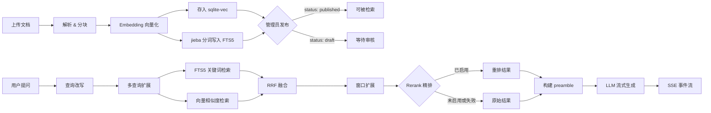

RWiki 是一个 RAG + Agent 知识库问答平台：后端用 Rust（Axum）处理文档解析、向量化、检索和流式对话，前端用 React SPA 提供聊天界面，同时支持以 widget 形式嵌入外部站点。

## 技术栈

- **后端**：Rust + Axum + rusqlite + sqlite-vec + rig-core
- **前端**：React + TypeScript + TanStack Router/Query + Tailwind CSS

选 sqlite-vec 而不是 Pinecone / Milvus，是因为 rwiki 定位为轻量私有部署——一个二进制文件加一个 `.db` 文件就能跑起来，不需要外部服务。代价是没法水平扩展，但对于单团队知识库场景，这个取舍合理。

选 rig-core 做 LLM 调用，因为它在 OpenAI 兼容 API 上做了薄封装，同时支持 OpenAI、OpenRouter、BigModel 等多种 provider，切换只需要改 `base_url`。

## 核心流程：RAG 管线

从文档上传到用户收到回答，数据经过以下环节：

### 上传与解析

通过 `POST /api/documents/upload` 上传文件（需要 Bearer Token）。支持：

- **.xlsx**：逐行解析，每行格式化为 `header1: value1, header2: value2, ...` 的文本。
- **.md / .mdx**：按 Markdown 标题层级分块，支持 YAML frontmatter 提取元数据。

超长 chunk 会被按 Markdown 语义边界进一步切分。

### 向量化与存储

每个 chunk 的文本通过 Embedding API 转为向量（批处理，每批 64 条），存入 sqlite-vec 虚拟表。相同内容会自动去重，跳过重复的 API 调用。

同时，每个 chunk 的文本会用 [jieba](https://github.com/messense/jieba-rs)（中文分词）进行分词，写入 FTS5 虚拟表（`fts_chunks`）。这样检索时可以同时做 BM25 关键词搜索和向量相似度搜索，两种结果通过 Reciprocal Rank Fusion（RRF）融合排序。

### 文档状态

文档状态流转：`processing` → `draft` → `published`（或 `failed`）。

- `processing`：上传后正在解析和向量化
- `draft`：处理完成，等待管理员审核，此状态下内容不会被搜索到
- `published`：管理员确认发布后，chunk 参与向量检索

加 draft 状态是因为数据质量不可控——加一层人工审核比直接上线再删更安全。

### 检索与对话

用户通过 `POST /api/chat` 发起对话（无需鉴权）：

1. **会话管理**：请求携带可选的 `sessionId`，没有则生成新的
2. **查询改写**：所有查询（不只是追问）都会经过改写。首轮查询时，LLM 会把短或模糊的输入扩展为更具体、更可检索的形式；追问时则结合对话历史解析代词和上下文。当配置了 `content_language`（如 `"English"`）时，改写 prompt 会引导 LLM 将查询翻译为目标语言，使 FTS5 关键词搜索和向量检索都能跨语言命中。改写输出最多 2 条查询变体（JSON 格式），有 8 秒超时——超时或失败时回退到原始查询
3. **混合检索**：对每条查询变体，并行执行两种搜索：
   - **FTS5 关键词搜索**：BM25 排序的全文检索，用 jieba 分词的内容做匹配。擅长精确关键词命中和中文分词
   - **向量相似度搜索**：sqlite-vec 中的余弦距离搜索。擅长语义匹配，即使措辞不同也能命中
4. **RRF 融合**：关键词和向量搜索的结果通过 Reciprocal Rank Fusion 合并（`score = Σ 1/(k + rank)`，`k=60`）。按 `chunk_id` 去重后输出一份统一排序列表
5. **窗口扩展**：对排名靠前的结果，根据相同 `page_id` 和相邻 `sub_index` 获取上下文 chunk，给 LLM 提供完整上下文
6. **Rerank 精排**（可选）：在 RRF 融合和窗口扩展之后，通过 cross-encoder API 对 top-N 候选结果重新打分排序。默认关闭，在 `[rerank]` 配置段中设置 `enable = true` 启用
   - **OpenRouter**：使用 Cohere rerank 模型（如 `cohere/rerank-v4-fast`），免费
   - **智谱 BigModel**：使用 `rerank-pro` 模型，国内低延迟
   - **优雅降级**：网络错误、超时、鉴权失败、响应解析失败等任何异常发生时，直接使用 RRF 融合的原始结果，用户无感知，仅记录 warn 级别日志
   - **跳过条件**：`enable = false`（默认）时不初始化 reranker，整个阶段被跳过，零开销
   - 候选数量由 `top_n` 控制（默认 20），仅将截断后的 top-N 文档内容发送给 rerank API
7. **上下文组装**：检索结果格式化为结构化 XML，包裹在 `<documents>` 块中。每个结果生成一个 `<document index="N">` 元素，包含 `<title>`、`<section>`、`<link>`、`<locale>`、`<content>` 标签。这给 LLM 提供了清晰的、机器可解析的上下文，支持按编号引用来源
8. **流式生成**：通过 SSE 事件推送到前端，事件类型包括 `session`、`chunk`、`done`、`error`。默认系统提示词指示 LLM 使用 `[Source N]` 格式引用来源，其中 N 对应上下文 XML 中的 document index

### 推荐问题

`GET /api/chat/suggestions?locale=zh-CN` 返回预配置的推荐问题列表，用于聊天空状态展示。locale 匹配在服务端完成：精确匹配、最长前缀匹配、然后回退到 `default`。这样主聊天界面不需要内置 locale 逻辑（但 widget 支持通过 `suggestedQuestions` 配置在客户端做 locale 匹配）。

### 消息反馈

用户可以对每条 AI 回答提交赞/踩反馈，用于追踪低质量回答，帮助改进知识库覆盖和检索质量。

- `POST /api/chat/feedback` — 提交或取消反馈（无需鉴权）
- `GET /api/chat/feedback` — 查询反馈列表（需要 Bearer Token，支持 `feedback`、`limit`、`offset` 查询参数）

提交反馈使用 UPSERT：如果用户已经对某条消息提交过反馈，会更新已有记录。发送 `feedback: null` 会取消之前的反馈（幂等删除）。

前端在流式回答完成后，在消息气泡底部渲染赞/踩按钮。再次点击同一按钮会取消反馈。UI 使用乐观更新——按钮状态立即变化，API 调用失败时自动回滚。
